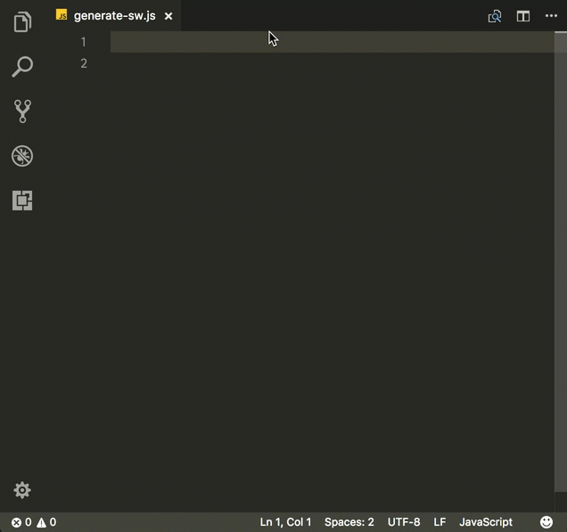

# VS Code Extension for PWA Tooling
VS Code Extension for PWA Tools

This extension for Visual Studio Code adds snippets and JSON schema for a `manifest.json` for creating Progressive Web Apps (PWA).

**THIS IS AN ALPHA VERSION**



See the [CHANGELOG](CHANGELOG.md) for the latest changes

## Usage
Type part of a snippet, press `enter`, and the snippet unfolds.

### JavaScript Snippets
```javascript
pwa-inject-precache           // inject precache list into service worker
pwa-custom-service-worker     // create a service worker file which can be extended
pwa-generate-service-worker   // generate a service worker with a precache manifest
```

### HTML Snippets
```javascript
pwa-manifest-link             // create the link to the manifest.json
pwa-apple-mobile-web-capable  // add the meta tag for apple mobile web capable
```

### TypeScript Snippets
```javascript
pwa-register                  // function that registers the service worker
```

### JSON Snippets
```javascript
pwa-manifest                  // * create the contents of `manifest.json`
```

Alternatively, press `Ctrl`+`Space` (Windows, Linux) or `Cmd`+`Space` (OSX) to activate snippets from within the editor.

## Installation

1. Install Visual Studio Code 1.10.0 or higher
2. Launch Code
3. From the command palette `Ctrl`-`Shift`-`P` (Windows, Linux) or `Cmd`-`Shift`-`P` (OSX)
4. Select `Install Extension`
5. Choose the extension `PWA-Tools`
6. Reload Visual Studio Code

## Try it Out

Let's take a PWA for a spin. Using the Angular CLI, let's generate a new app and add PWA features.

Before we begin, install the Angular CLI and lite-server, if you haven't already done so, by running `npm i @angular/cli lite-server -g`

1. Create an Angular app with `ng new my-app --routing` and open the app in VS Code
1. Create `src/manifest.json`
1. Use the `pwa-manifest` snippet
1. Open `src/index.html` and use the `pwa-manifest-link` snippet (in the <head></head> element)
1. Use the pwa-apple-mobile-web-capable snippet (in the <head></head> element)
1. Create `generate-sw.js`
1. Run `cd my-app` and then `npm i workbox-build` (add --save if you're using npm < 5.x)
1. Use the pwa-generate-service-worker in `generate-sw.js`
1. Add "manifest.json" to the `apps[0].assets` array in `.angular-cli.json`
1. Open `src/app/main.ts` and run `pwa-register` at the bottom
1. Call `.then(() => registerServiceWorker());` after bootstrapping
1. Run `ng build --prod && node generate-sw.js && cd dist && lite-server`

**Now test it!**

Your app should be running in the browser. Open the developer tools, go to the `Application` tab, and select `Service Workers`. Inspect the service worker, and try to go offline and refresh.

